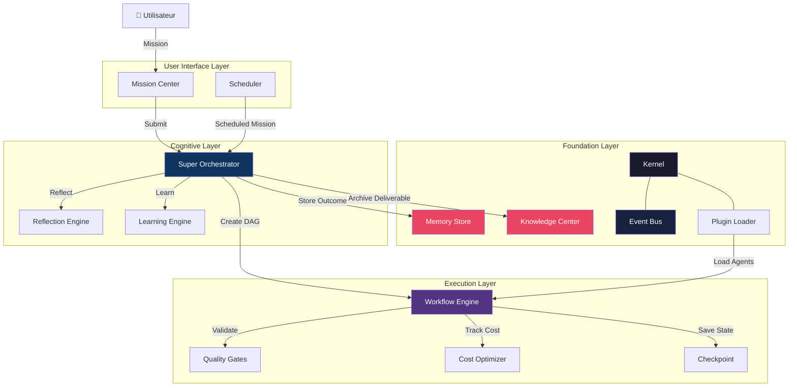
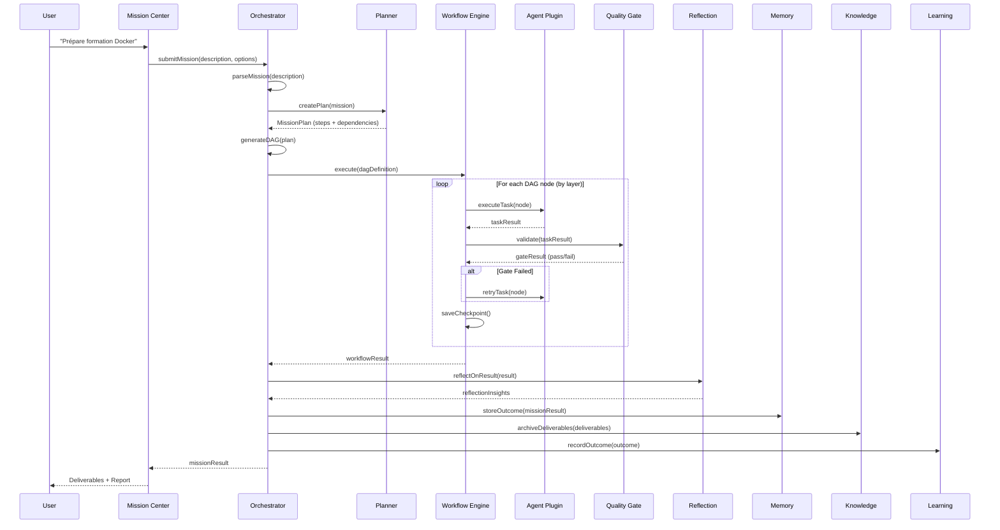
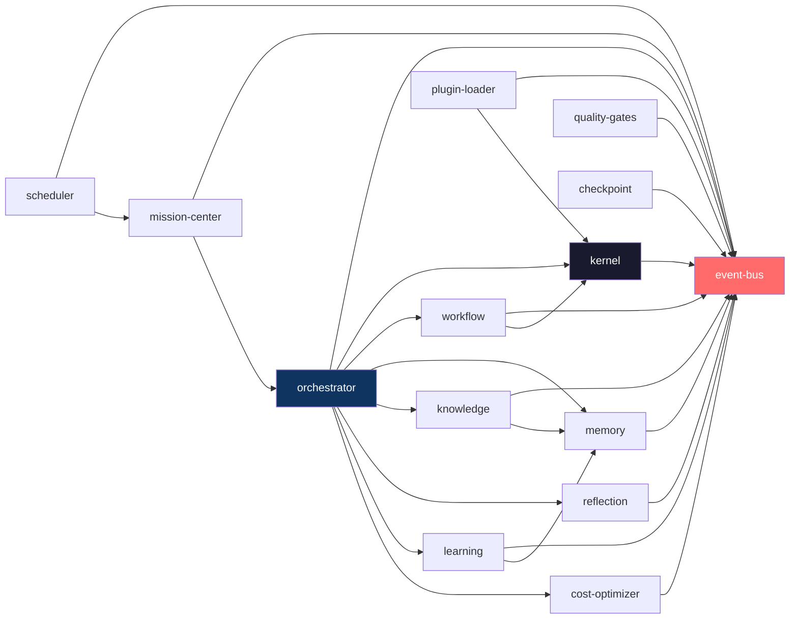
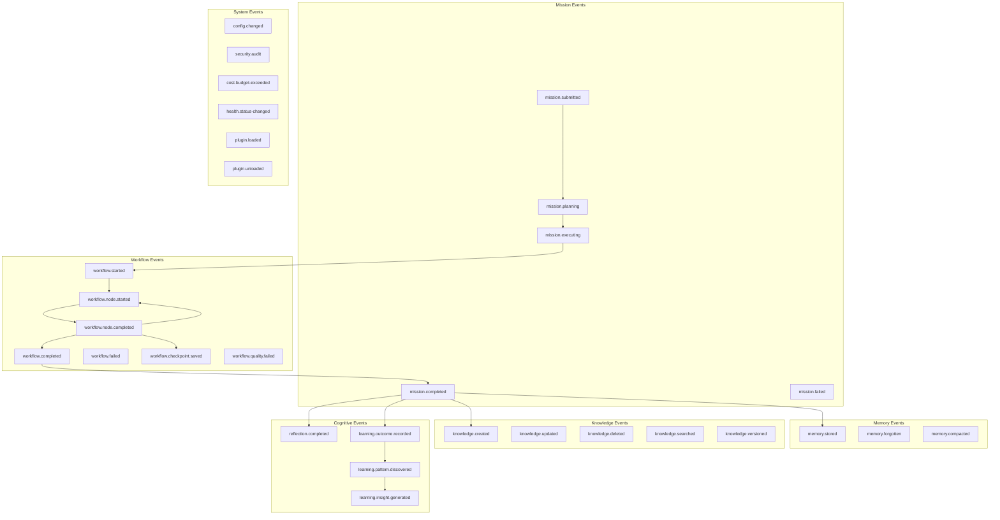
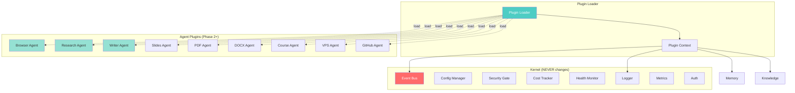
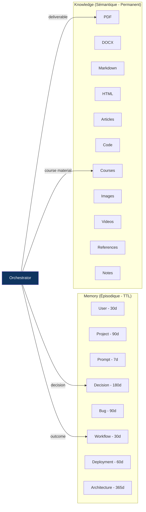

# ALTER EGO OS — Architecture Diagrams

## 1. System Overview

```mermaid
graph TB
    User[👤 Utilisateur]
    MC[Mission Center]
    ORCH[Super Orchestrator]
    WF[Workflow Engine]
    MEM[Memory Store]
    KN[Knowledge Center]
    KER[Kernel]
    EB[Event Bus]
    PL[Plugin Loader]
    SCH[Scheduler]
    REF[Reflection Engine]
    LRN[Learning Engine]
    QG[Quality Gates]
    CO[Cost Optimizer]
    CP[Checkpoint]

    subgraph "User Interface Layer"
        MC
        SCH
    end

    subgraph "Cognitive Layer"
        ORCH
        REF
        LRN
    end

    subgraph "Execution Layer"
        WF
        QG
        CO
        CP
    end

    subgraph "Foundation Layer"
        KER
        EB
        MEM
        KN
        PL
    end

    User -->|"Mission"| MC
    MC -->|"Submit"| ORCH
    ORCH -->|"Create DAG"| WF
    ORCH -->|"Reflect"| REF
    ORCH -->|"Learn"| LRN
    ORCH -->|"Store Outcome"| MEM
    ORCH -->|"Archive Deliverable"| KN
    WF -->|"Validate"| QG
    WF -->|"Track Cost"| CO
    WF -->|"Save State"| CP
    SCH -->|"Scheduled Mission"| ORCH
    PL -->|"Load Agents"| WF

    KER --- EB
    KER --- PL

    style KER fill:#1a1a2e,color:#fff
    style EB fill:#16213e,color:#fff
    style ORCH fill:#0f3460,color:#fff
    style WF fill:#533483,color:#fff
    style MEM fill:#e94560,color:#fff
    style KN fill:#e94560,color:#fff
```

## 2. Mission Execution Flow

```mermaid
sequenceDiagram
    participant U as User
    participant MC as Mission Center
    participant ORCH as Orchestrator
    participant PL as Planner
    participant WF as Workflow Engine
    participant AG as Agent Plugin
    participant QG as Quality Gate
    participant REF as Reflection
    participant MEM as Memory
    participant KN as Knowledge
    participant LRN as Learning

    U->>MC: "Prépare formation Docker"
    MC->>ORCH: submitMission(description, options)
    ORCH->>ORCH: parseMission(description)
    ORCH->>PL: createPlan(mission)
    PL-->>ORCH: MissionPlan (steps + dependencies)
    ORCH->>ORCH: generateDAG(plan)
    ORCH->>WF: execute(dagDefinition)
    
    loop For each DAG node (by layer)
        WF->>AG: executeTask(node)
        AG-->>WF: taskResult
        WF->>QG: validate(taskResult)
        QG-->>WF: gateResult (pass/fail)
        alt Gate Failed
            WF->>AG: retryTask(node)
        end
        WF->>WF: saveCheckpoint()
    end
    
    WF-->>ORCH: workflowResult
    ORCH->>REF: reflectOnResult(result)
    REF-->>ORCH: reflectionInsights
    ORCH->>MEM: storeOutcome(missionResult)
    ORCH->>KN: archiveDeliverables(deliverables)
    ORCH->>LRN: recordOutcome(outcome)
    ORCH-->>MC: missionResult
    MC-->>U: Deliverables + Report
```

## 3. Package Dependencies

```mermaid
graph LR
    EB[event-bus]
    KER[kernel]
    WF[workflow]
    MEM[memory]
    KN[knowledge]
    ORCH[orchestrator]
    MC[mission-center]
    REF[reflection]
    LRN[learning]
    SCH[scheduler]
    PL[plugin-loader]
    CO[cost-optimizer]
    QG[quality-gates]
    CP[checkpoint]

    KER --> EB
    WF --> EB
    WF --> KER
    MEM --> EB
    KN --> EB
    KN --> MEM
    ORCH --> EB
    ORCH --> KER
    ORCH --> WF
    ORCH --> MEM
    ORCH --> KN
    ORCH --> REF
    ORCH --> LRN
    ORCH --> CO
    MC --> EB
    MC --> ORCH
    SCH --> EB
    SCH --> MC
    PL --> EB
    PL --> KER
    REF --> EB
    LRN --> EB
    LRN --> MEM
    CO --> EB
    QG --> EB
    CP --> EB

    style EB fill:#ff6b6b,color:#fff
    style KER fill:#1a1a2e,color:#fff
    style ORCH fill:#0f3460,color:#fff
```

## 4. Event Flow

```mermaid
graph TD
    subgraph "Mission Events"
        ME1[mission.submitted]
        ME2[mission.planning]
        ME3[mission.executing]
        ME4[mission.completed]
        ME5[mission.failed]
    end

    subgraph "Workflow Events"
        WE1[workflow.started]
        WE2[workflow.node.started]
        WE3[workflow.node.completed]
        WE4[workflow.completed]
        WE5[workflow.failed]
        WE6[workflow.checkpoint.saved]
        WE7[workflow.quality.failed]
    end

    subgraph "Memory Events"
        ME6[memory.stored]
        ME7[memory.forgotten]
        ME8[memory.compacted]
    end

    subgraph "Knowledge Events"
        KE1[knowledge.created]
        KE2[knowledge.updated]
        KE3[knowledge.deleted]
        KE4[knowledge.searched]
        KE5[knowledge.versioned]
    end

    subgraph "Cognitive Events"
        CE1[reflection.completed]
        CE2[learning.outcome.recorded]
        CE3[learning.pattern.discovered]
        CE4[learning.insight.generated]
    end

    subgraph "System Events"
        SE1[config.changed]
        SE2[security.audit]
        SE3[cost.budget-exceeded]
        SE4[health.status-changed]
        SE5[plugin.loaded]
        SE6[plugin.unloaded]
    end

    ME1 --> ME2 --> ME3
    ME3 --> WE1
    WE1 --> WE2 --> WE3
    WE3 --> WE6
    WE3 --> WE2
    WE3 --> WE4
    WE4 --> ME4
    ME4 --> CE1
    ME4 --> CE2
    CE2 --> CE3 --> CE4
    ME4 --> ME6
    ME4 --> KE1
```

## 5. Plugin Architecture

```mermaid
graph TB
    subgraph "Kernel (NEVER changes)"
        EB[Event Bus]
        CFG[Config Manager]
        SEC[Security Gate]
        CST[Cost Tracker]
        HM[Health Monitor]
        LOG[Logger]
        MET[Metrics]
        AUTH[Auth]
    end

    subgraph "Plugin Loader"
        PL[Plugin Loader]
        CTX[Plugin Context]
    end

    subgraph "Agent Plugins (Phase 2+)"
        BA[Browser Agent]
        RA[Research Agent]
        WA[Writer Agent]
        SA[Slides Agent]
        PA[PDF Agent]
        DA[DOCX Agent]
        CA[Course Agent]
        VA[VPS Agent]
        GA[GitHub Agent]
    end

    PL --> CTX
    CTX --> EB
    CTX --> MEM[Memory]
    CTX --> KN[Knowledge]
    CTX --> LOG

    PL -.->|load| BA
    PL -.->|load| RA
    PL -.->|load| WA
    PL -.->|load| SA
    PL -.->|load| PA
    PL -.->|load| DA
    PL -.->|load| CA
    PL -.->|load| VA
    PL -.->|load| GA

    style EB fill:#ff6b6b,color:#fff
    style PL fill:#4ecdc4,color:#fff
    style BA fill:#95e1d3
    style RA fill:#95e1d3
    style WA fill:#95e1d3
```

## 6. Memory Types & TTL

```mermaid
graph LR
    subgraph "Memory (Épisodique - TTL)"
        M1[User - 30d]
        M2[Project - 90d]
        M3[Prompt - 7d]
        M4[Decision - 180d]
        M5[Bug - 90d]
        M6[Workflow - 30d]
        M7[Deployment - 60d]
        M8[Architecture - 365d]
    end

    subgraph "Knowledge (Sémantique - Permanent)"
        K1[PDF]
        K2[DOCX]
        K3[Markdown]
        K4[HTML]
        K5[Articles]
        K6[Code]
        K7[Courses]
        K8[Images]
        K9[Videos]
        K10[References]
        K11[Notes]
    end

    ORCH[Orchestrator] -->|outcome| M6
    ORCH -->|deliverable| K1
    ORCH -->|decision| M4
    ORCH -->|course material| K7

    style ORCH fill:#0f3460,color:#fff
```
